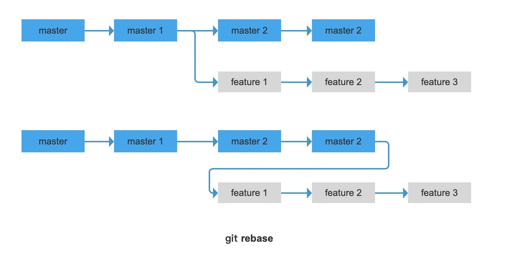
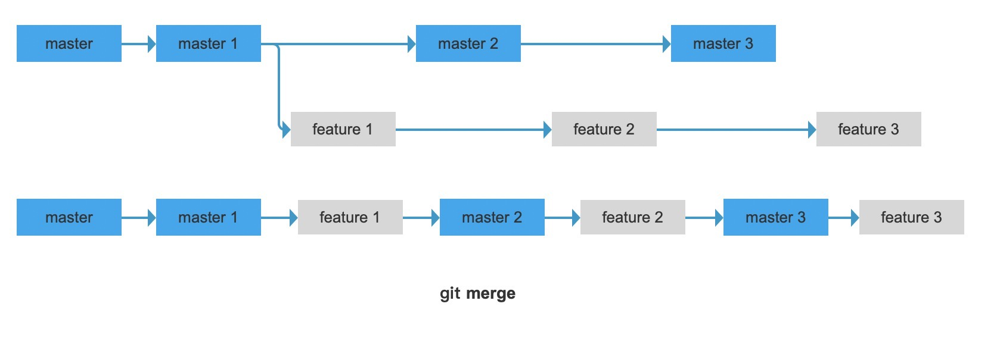
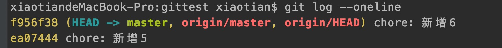
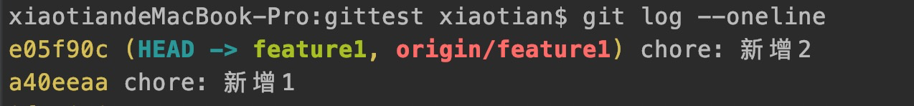

# Git 命令介绍

### git rebase 与 git merge 的区别

**git rebase**:  
变基，顾名思义，改变开发内容的基点。  
项目中一般用作多人合作的时候，你所开发的新的需求或者功能，要合并到线上分支，需要在最新的master的基础上提交  
1、git rebase --abort 会放弃合并，回到rebase操作之前的状态，之前的提交的不会丢弃；即回到撤销 rebase，回到没有 pull 时的状态  
2、git rebase --skip 则会将引起冲突的commits丢弃掉（；  
3、git rebase --continue 合并冲突，结合"git add 文件"命令一起用与修复冲突，提示开发者，一步一步地有没有解决冲突。（fix conflicts and then run “git rebase --continue”）  



**git merge**:   
根据合并的时间进行合并分支  



### git cherry-pick
可以理解为定制版的merge，只是不是分支合并，是把别的分支上的一次提交 commitID 放到当前的分支里面，

**master 分支**



**feature1 分支**


现在把 master 分支 上的提交 ea07444 内容合并到 feature1, 遇到冲突解决冲突并且提交
```shell script
# 分支名为feature1
$ git cherry-pick ea07444
```
