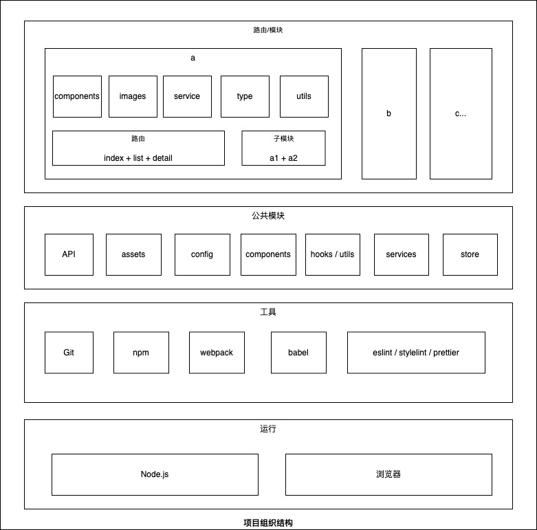

# 组织结构



```shell
.
├── dist ####################################### 构建输出路径
├── mock ####################################### 接口模拟配置
├── public ##################################### 静态资源（非打包）
├── src ######################################## 源代码
│   ├── api #################################### 网络请求层
│   ├── assets ################################# 全局公共资源（打包）
│   │   ├── images ############################# 图片资源
│   │   │   └── 模块_类别_功能_状态.扩展名
│   │   └── fonts ############################## 字体资源
│   ├── components ############################# 全局公共组件
│   ├── config ################################# 全局配置
│   ├── hooks ################################## 全局公共 Hooks
│   ├── pages/views ############################ 路由页面
│   │   ├── xxx ################################ 业务模块
│   │   │   ├── xxx1 ########################### 业务组子模块 1
│   │   │   ├── xxx2 ########################### 业务组子模块 2
│   │   │   └── xxx3 ########################### 业务组子模块 3
│   │   ├── yyy ################################ 业务员模块
│   │   └── zzz ################################ 业务员模块
│   ├── service ################################ 业务逻辑层
│   ├── store ################################## 全局状态管理
│   ├── types ################################## 全局公共类型
│   ├── utils ################################## 全局公共工具
│   ├── global.d.ts ############################ 全局类型定义
│   └── main.ts ################################ 应用入口
├── .editorconfig ############################## 编辑器通用配置
├── .eslintrc.js ############################### JS 审查配置
├── .gitignore ################################# 版本管理配置
├── .npmrc ##################################### 依赖管理配置
├── .prettierrc.js ############################# 代码格式化配置
├── .stylelintrc.js ############################ 样式审查配置
├── README.md ################################## 项目开发说明
├── babel.config.js ############################ 编译配置
├── package-lock.json ########################## 依赖版本锁
├── package.json ############################### 项目配置
└── tsconfig.json ############################## TypeScript 配置
```

## 接口模拟配置

`./mock/` 用于放置 [HTTP Mocker](http://10.107.147.97:38000/mocker/) 需要的接口模拟配置，其下的模块按域名、服务、模块和功能划分。

如下所示是会员的接口模拟配置目录结构：

```shell
.
├── ...
├── mock ####################################### 接口模拟配置
│   ├── base ################################### https://api.xxx.cn
│   │   ├── member ############################# 会员业务
│   │   │   ├── config ######################### 配置模块
│   │   │   │   ├── list ####################### 配置列表
│   │   │   │   └── query ###################### 配置查询
│   │   │   ├── order ########################## 会员订单
│   │   │   └── ... ############################ 其他模块
│   │   └── user ############################## 用户服务
│   ├── yyy ##################################### https://yyy-api.xxx.cn
│   └── zzz ##################################### https://zzz-api.xxx.cn
└──
```

要点：

1. 按“域名》服务》模块》功能”的层级结构划分目录结构
2. 按统一约定的域名别名来划分域名目录

    - base：https://base-api.xxx.cn
    - bd：https://yyy-api.xxx.cn
    - wx：https://zzz-api.xxx.cn

## 静态资源（非打包）

`./public/` 用于放置非打包的静态资源，例如：HTML 模板、图片和字体等素材。


```shell
.
├── ...
├── public ##################################### 静态资源（非打包）
│   ├── static ################################# 静态资源
│   │   ├── styles ############################# 样式资源
│   │   ├── fonts ############################## 字体资源
│   │   ├── images ############################# 图片资源
│   │   └── sctipts ############################ 脚本资源
│   └── index.html ############################# HTML 模板
└──
```

ps：一般静态资源都需要放在源代码中作为模块依赖引入，在使用前端工具构建打包后会进行自动优化（较小的资源转成 base64，较大的资源以源文件的形式拷贝到输出目录，且在资源文件名后追加 hash 值，所以和源代码里面的资源主要区别在于文件是否版本化管理了）。如果需要在代码里配置静态资源的访问路径，那么就可以把静态资源放在 `./public/` 目录下，然后拼上站点地址即可访问图片，例如一些需要配置传给客户端的图标资源和分享图片。

## 源代码

`./src/` 用于放置源代码，其根目录下主要放置一些全局公共模块，除此之外是业务模块一般放在路由目录下，通常命名为 pages 或 views。

### 网络请求

网络请求层封装了不同域名或服务的网络请求实例，一般统一以域名维度划分且命名为 `xxxApi`，如果有些特定的服务需要特殊的拦截器和配置，那么可以按服务命名，例如 `memberApi`。

```shell
├── src
│   ├── api #################################### 网络请求层
│   │   ├── baseApi ############################ https://api.xxx.cn
│   │   ├── yyyApi ############################## https://yyy-api.xxx.cn
│   │   └── zzzApi ############################## https://zzz-api.xxx.cn
├── ...
```

ps：类似接口模拟配置，建议按下面的统一方式命名。

- baseApi：https://api.xxx.cn
- yyyApi：https://yyy-api.xxx.cn
- zzzApi：https://zzz-api.xxx.cn

### 公共资源

公共资源目录放置了全局可复用的静态资源，静态资源一般命名为 `模块_类别_功能_状态.扩展名`。

```shell
├── src
│   ├── api #################################### 网络请求层（封装了各个域名的请求工具哈数）
│   ├── assets ################################# 静态资源目录（打包）
│   │   ├── images ############################# 图片资源
│   │   │   └── 模块_类别_功能_状态.扩展名
│   │   └── fonts ############################## 字体资源
├── ...
```

### 公共组件

公共组件层目录封装了全局通用的可复用组件，一般采用大驼峰命名法，例如 `Xyz`（个别技术栈需要区分命名，例如：uni-app 一般以 `c-` 作为前缀，统一使用小写字母，多个单词使用连字符号）。

```shell
├── src
│   ├── components ############################# 公共组件目录
│   │   ├── Xxx ################################ 公共组件模块
│   │   │   └── index.js
│   │   ├── Yyy ################################ 公共组件模块
│   │   │   └── index.js
│   │   └── index ############################## 输出路径
├── ...
```

### 公共配置

公共配置层封装了全局公共的常量配置，其下的模块一般以小驼峰，一般以大写字母和下划线命名的变量形式输出。如果常量配置较多，可以按功能进行划分，例如：页面相关的变量放在 page 模块，站点地址相关的常量放在 site 目录下，其他不确定的统一放 constants 模块下。


```shell
├── src
│   ├── config ################################# 全局配置目录
│   │   ├── constants ########################## 不确定模块的常量配置
│   │   ├── page ############################### 页面路由相关的常量配置
│   │   └── site ############################### 站点地址相关的常量配置
├── ...
```

### 公共 Hooks

公共 Hooks 目录主要针对 Hook API 的react 和 vue 等框架，封装了全局公共的 Hook，一般命名为 `useXyz`。

```

```shell
├── src 
│   ├── hooks ################################## 全局公共 Hooks 目录
│   │   └── useXyz
├── ...
```

### 路由页面（业务模块）

路由页面目录一般按业务模块进行划分（禁止按 UI 状态划分），模块目录以小写字母和连字符号组成，一般子路径等价于路由注册路径。

```shell
.
├── src
│   ├── pages/views ############################ 路由页面目录
│   │   ├── xxx ################################ 业务模块目录
│   │   │   ├── xxx-1 ########################### 业务子模块 1
│   │   │   ├── xxx-2 ########################### 业务子模块 2
│   │   │   ├── components ##################### 业务模块公共组件目录
│   │   │   │   ├── Xxx ######################## 公共组件模块
│   │   │   │   │   └── index.js
│   │   │   │   ├── Yyy ######################## 公共组件模块
│   │   │   │   │   └── index.js
│   │   │   │   └── index ###################### 输出路径
│   │   │   ├── images ########################## 业务模块公共工具目录
│   │   │   ├── utils ########################## 业务模块公共工具目录
│   │   │   ├── index.{tsx|vue} ################ 业务模块入口页面
│   │   │   ├── list.{tsx|vue| ################# 业务模块列表页面
│   │   │   ├── detail.{tsx|vue} ############### 业务模块详情页面
│   │   │   ├── service.ts ##################### 业务模块业务逻辑实现
│   │   │   └── type.ts ######################## 业务模块类似定义
│   │   ├── yyy ################################ 业务员模块目录
│   │   └── zzz ################################ 业务员模块目录
├── ...
```

要点：

1. 路由页面目录一定要按业务模块划分，不能以产品原型或设计的布局划分。

    产品原型和设计一般变化频率较高，一个位置今天可能显示模块 A，明天可能显示模块 B。如果按显示去划分子目录，后期应对变化的扩展性会变得很差。此外，编码过程中一定要遵循低耦合高内聚的原则，同一个业务模块的功能应该放在同一个目录下，方便代码的重用和解耦。

2. 模块目录和路由组件要以小写字母和连字符号命名，主要目的是为了区分非路由目录和组件，更加方便维护者知晓当前模块下有哪些路由，以及跟进路由快速定位源代码；
3. 除了路由组件外，其他的代码按功能可以划分为 components、utils、service 和 type

    - components：该业务模块下可复用的公共组件
    - images：该业务模块下可复用的公共组件
    - utils：该业务模块下可复用的公共工具函数
    - service：该业务模块下的业务接口请求逻辑封装
    - type：该业务模块下的公共数据（业务和 UI 状态）类型

3. 模块可以互相嵌套，一个大模块下面包含多个子模块，子模块相关的实现放在主模块的子目录下。

ps：路由页面不仅仅是放置路由组件的，更应该是当做业务模块目录，不同业务模块的公共组件和 API 就应该放在该路由下的模块目录里，而不是全部都放在全局目录下。此外，如果有模块之间需要相互引用公共组件，如果该组件跟业务无关，那么可以提取到全局目录下，否则允许路由模块之间的相互引用。

参考：[项目结构优化实战](/guide/project/structure-in-action.html)

### 业务逻辑层

业务逻辑层封装了全局可复用的业务逻辑(服务端的接口请求)，其下的文件按业务模块划分，一般命名为 `xxxService`。

```shell
├── src
│   ├── service ################################ 业务逻辑层
│   │   ├── abtestService.ts ################### AB 测试相关的公共业务逻辑
│   │   ├── memberService.ts ################### 会员相关的公共业务逻辑
│   │   └── userService.ts ##################### 用户相关的公共业务逻辑
├── ...
```

要点：业务逻辑层主要是针对服务端接口调用的封装，需要在每个方法上提供好相关的接口文档链接、入参和返回说明。此外，在一些复杂的业务场景下需要组合多个接口调用，以及对接口返回值进行封装处理，统一业务数据模型。

### 全局状态管理

`./src/store` 封装了全局状态管理模块。

```shell
├── src ######################################## 源代码
│   ├── store ################################## 全局状态管理
│   │   ├── user.ts ############################ 用户管理模块
│   │   └── index.ts ########################### 对外输出模块
├── ...
```

### 公共类型层

`./src/types` 封装了全局公共的业务类型（类似于服务端的数据表实体），一般以业务模块划分供全局使用，也方便维护者快速熟悉业务。

```shell
├── src ######################################## 源代码
│   ├── store ################################## 全局状态管理
│   │   ├── member.ts ########################## 会员业务类型
│   │   ├── user.ts ############################ 用户业务类型
│   │   └── index.ts ########################### 对外输出模块
├── ...
````

要点：业务类型指的是跟业务相关的数据结构类型（使用 TS interface 定义），例如：会员模块相关的业务类型有会员卡类型，用户模块相关的业务类型有用户个人信息类型，用户会员信息类型等。不同的业务模块类型可以相互引用。

### 公共工具层

`./src/utils` 主要放置全局可复用的一些工具函数。
